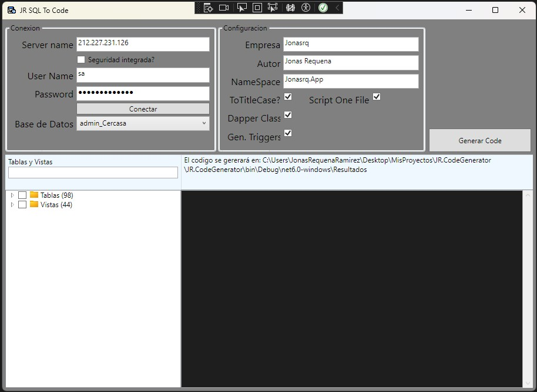

# Introduction 
Genera clases de entity o models a partir de tu base de datos. Solo necesitas los datos de conexión a tu servidor SQL Server.

# Version
Versión actual: 2.0

# Features
- Generación automática de clases basadas en tablas y vistas de la base de datos.
- Soporte para bases de datos SQL Server.
- Interfaz gráfica para facilitar la conexión y selección de tablas/vistas.
- Código generado compatible con .NET 9.
- Personalización de nombres de clases y propiedades.
- Generación de repositorios y servicios Dapper.
- Creación de controladores API.
- Plantillas personalizables para la generación de código.
- Soporte para auditoría de datos con scripts SQL.
- Generación de clases de validación.

# Getting Started
SDK .Net 9

1. Clona el repositorio.
2. Ejecuta el proyecto.
3. Haz clic en "Conectar".
4. Elige la base de datos a la que te quieres conectar.
5. Selecciona las tablas y/o vistas.
6. Haz clic en "Generar".

# Usage
1. Proporciona los datos de conexión a tu servidor SQL Server.
2. Selecciona la base de datos deseada.
3. Marca las tablas y vistas que deseas convertir en clases.
4. Personaliza los nombres de las clases y propiedades si es necesario.
5. Genera el código y guárdalo en tu proyecto.

# Interface
A continuación, se muestra una captura de pantalla de la interfaz del proyecto:

# Templates
El proyecto incluye diversas plantillas para generar:
- Clases de entidad
- Validadores
- Repositorios Dapper
- Servicios
- Controladores API
- Scripts SQL para auditoría
- Extensiones de conversión

# Contribute
Si quieres contribuir con este proyecto, ¡bienvenidas tus ideas!

